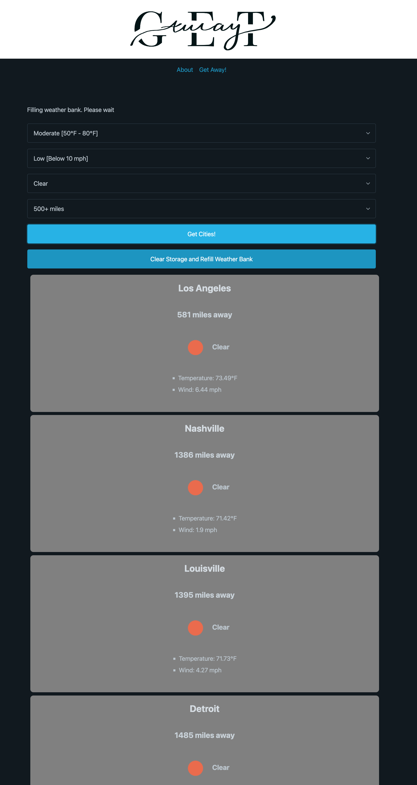

# parker-and-the-boys
Repo for the boys

## User Story
AS A weekend warrior
I WANT to find a location that meets my weather and distance preferences 
SO THAT I can get away this weekend

## Acceptance Critera
GIVEN a webpage with weather and distance criteria selections
WHEN I first visit the webpage
THEN I am presented with a loading bar indicating the Weather Bank is being filled
WHEN loading is complete
THEN I am presented with four criteria selection dropdowns
WHEN I use the criteria selection dropdowns
THEN I am able to enter my desired temperature, wind, weather condition, and distance preferences
WHEN I click Get Cities
THEN my current coordinates are gathered
When I click Get Cities
THEN I am presented with a list of viable cities that meet the conditions I'm seeking
WHEN I view a city
THEN I am presented with the current weather and distance from my location

## Description
This project is a Weekend Getaway helper application. If you've ever found yourself sitting at home on a Friday afternoon, wanting to get away somewhere for the weekend, but don't know where to go, this is the application for you! Upon first visit, the webpage will present the user with a loading bar, indicating that the weather bank is being filled with weather data for each city. Once complete, four dropdowns populate that allow the user to specify their desired temperature, wind, weather condition, and distance preferences. Upon clicking submit, the application will call APIs to get the user's current location, as well as each cities' location and the current conditions there. Any cities that meet the user's desired preferences will be presented to the user, allowing them to select which city they would like to visit.

Link to deployed app: https://pbodybrooks.github.io/parker-and-the-boys/

## Screenshot

## Installation
N/A

## Credits
Parker Brook - Javascript functionality, API Calls, Data Deconstruction, DOM traversal to HTML. HTML Elements including Navbar, dropdowns, and submit & reset buttons.
Jahsper Harrell - 
Anthony LaNier - 

## License
MIT License - Please refer to repo.

## Features
This project features Javascript to handle the functionality of the API calls and data deconstruction from the fetch return. It is also used for the Haversine formula to calculate the distance between two points (coordinates) on a sphere. The HTML and CSS are assisted by the Pico framework, making the webpage dynamically adjustable to different viewports. Specific features include two API calls, Async Await functionality to await the return of one API before running the other, event listeners, local storage, DOM Manipulation/Traversal, Template Literals, and more.
